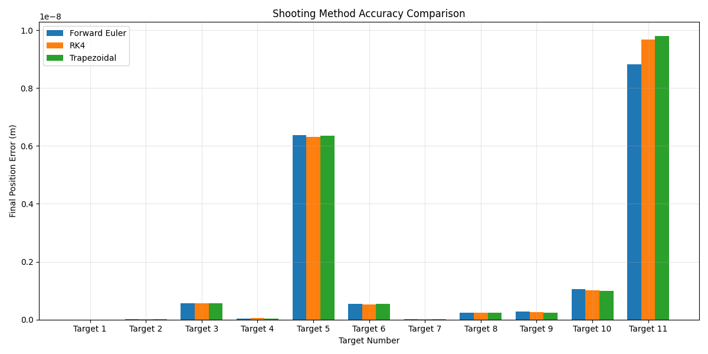

# Predictive Aiming System

A project that integrates **computer vision** and **numerical methods** to track, simulate, and optimize ball aiming and shooting in real-time. This system models ball motion, estimates parameters, and calculates optimal shooting angles for accurate targeting.

## Features

- **Ball tracking:** Real-time tracking of ball movement using computer vision techniques.  
- **Trajectory prediction:** Numerical integration methods (Forward Euler, RK4, Trapezoidal) simulate ball motion under physical constraints.  
- **Optimal shooting:** Uses Newton’s shooting method to calculate ideal angles and forces for hitting targets.  
- **Real-time simulation:** Incorporates physical constraints for realistic interaction with the environment.  
- **Parameter estimation:** Automatically estimates velocity, mass, and drag for accurate simulations.  

## Screenshots / Visualizations

**Method Accuracy & Metrics:**  

## Technology Stack

- **Programming Language:** Python  
- **Libraries:** OpenCV, NumPy, Pygame  
- **Methods:** Numerical integration (Forward Euler, RK4, Trapezoidal), Newton’s shooting method  
- **Simulation:** Real-time physics with collision detection, velocity damping, and constraint handling  

Project Insights

- Demonstrates integration of real-time computer vision with advanced numerical methods.

- Allows experimentation with different shooting parameters and numerical methods.

- Provides a foundation for games, physics-based simulations, or robotics applications.
